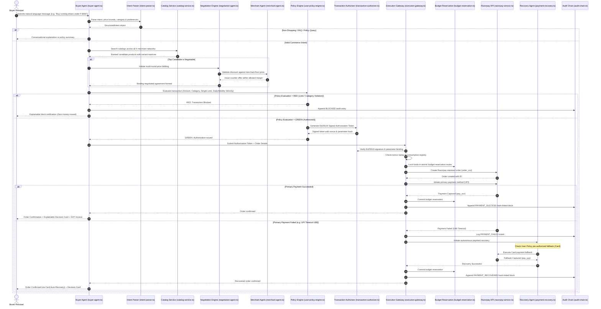

# 🔄 RazorX (AgentGate) — Execution Control Flow & State Machine Specification

> **Document Purpose**: *Detailed end-to-end execution paths, state transition matrices, sequence diagrams, and error handling branching for RazorX (AgentGate).*

---

## 1. Complete End-to-End Execution Sequence



---

## 2. Order & Payment State Machine

```
               [Initiated]
                    │
                    ▼
           [Intent Structured]
                    │
        ┌───────────┴───────────┐
        ▼                       ▼
   [Browse Mode]        [Purchase Mode]
        │                       │
        ▼                       ▼
 [Catalog Stream]     [Candidates Ranked]
                                │
                                ▼
                      [Negotiation Formed]
                                │
                                ▼
                     [Policy Evaluation]
                                │
                   ┌────────────┴────────────┐
                   ▼                         ▼
             [Policy: RED]             [Policy: GREEN]
                   │                         │
                   ▼                         ▼
             [Safe Halt]              [Ed25519 Signed]
                   │                         │
                   ▼                         ▼
            [Audit Blocked]           [Nonce Consumed]
                                             │
                                             ▼
                                      [Budget Reserved]
                                             │
                                             ▼
                                    [Razorpay Order Created]
                                             │
                                ┌────────────┴────────────┐
                                ▼                         ▼
                           [UPI Captured]            [UPI Failed]
                                │                         │
                                │                         ▼
                                │                 [Recovery Agent]
                                │                         │
                                │                         ▼
                                │                 [Card Fallback]
                                │                         │
                                └────────────┬────────────┘
                                             │
                                             ▼
                                     [Budget Committed]
                                             │
                                             ▼
                                     [Order Confirmed]
                                             │
                                             ▼
                                    [Merkle Block Appended]
                                             │
                                             ▼
                                   [Tax Invoice Issued]
```

---

## 3. Policy Decision Matrix & Invariants

| Policy Parameter | Test Invariant | Failure Action |
| :--- | :--- | :--- |
| **Single Transaction** | $P_{\text{order}} \le \text{single\_transaction\_limit}$ | Return `RED`, abort before payment creation. |
| **Daily Velocity** | $\text{Spent}_{\text{today}} + \text{Pending}_{\text{reservations}} + P_{\text{order}} \le \text{daily\_limit}$ | Return `RED`, block to prevent daily ceiling breach. |
| **Weekly Velocity** | $\text{Spent}_{\text{this\_week}} + P_{\text{order}} \le \text{weekly\_limit}$ | Return `RED`, block to protect weekly budget. |
| **Category Whitelist** | $\text{Category}_{\text{product}} \in \text{Allowed\_Categories}$ | Return `RED`, block unapproved category purchase. |
| **Autonomous Flag** | $\text{autonomous\_purchase} == \text{true}$ | If `false`, require manual human confirmation modal. |
| **Fallback Payment** | $\text{Method}_{\text{fallback}} \in \text{Allowed\_Payment\_Methods}$ | If unauthorized, abort recovery and trigger manual review. |
