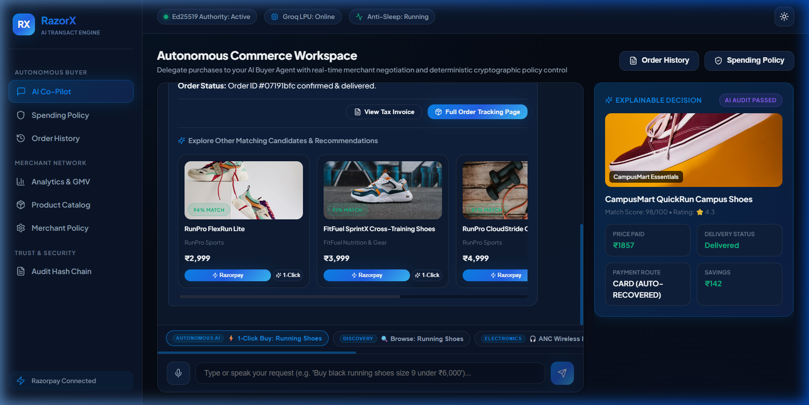
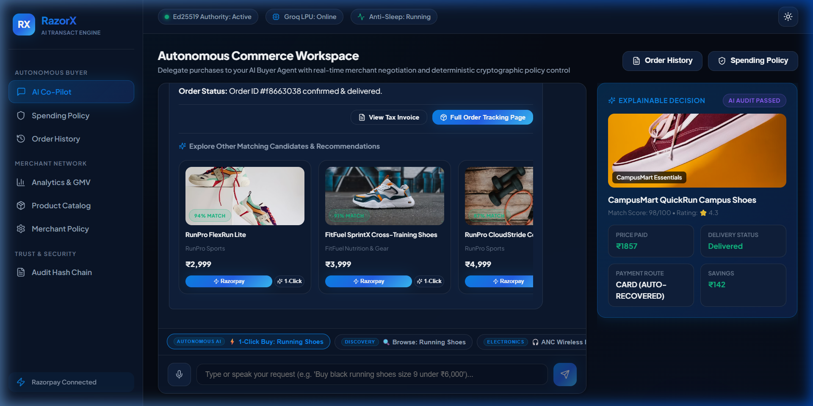
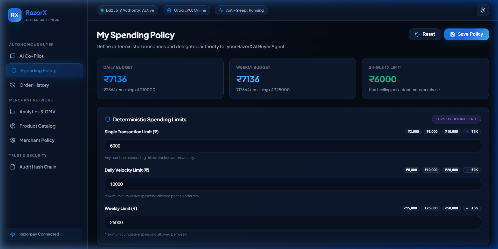
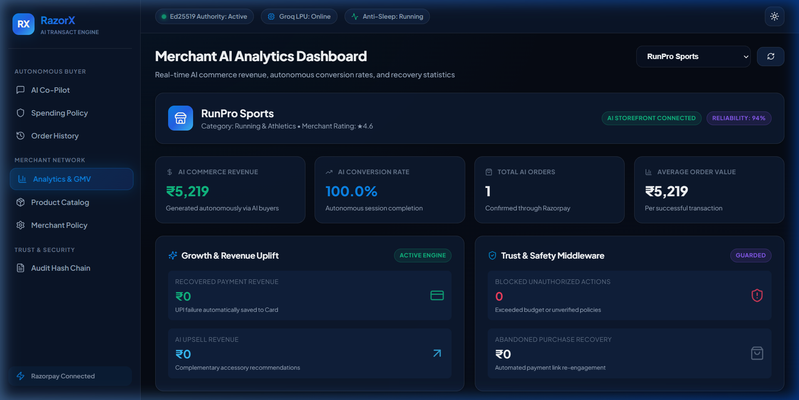
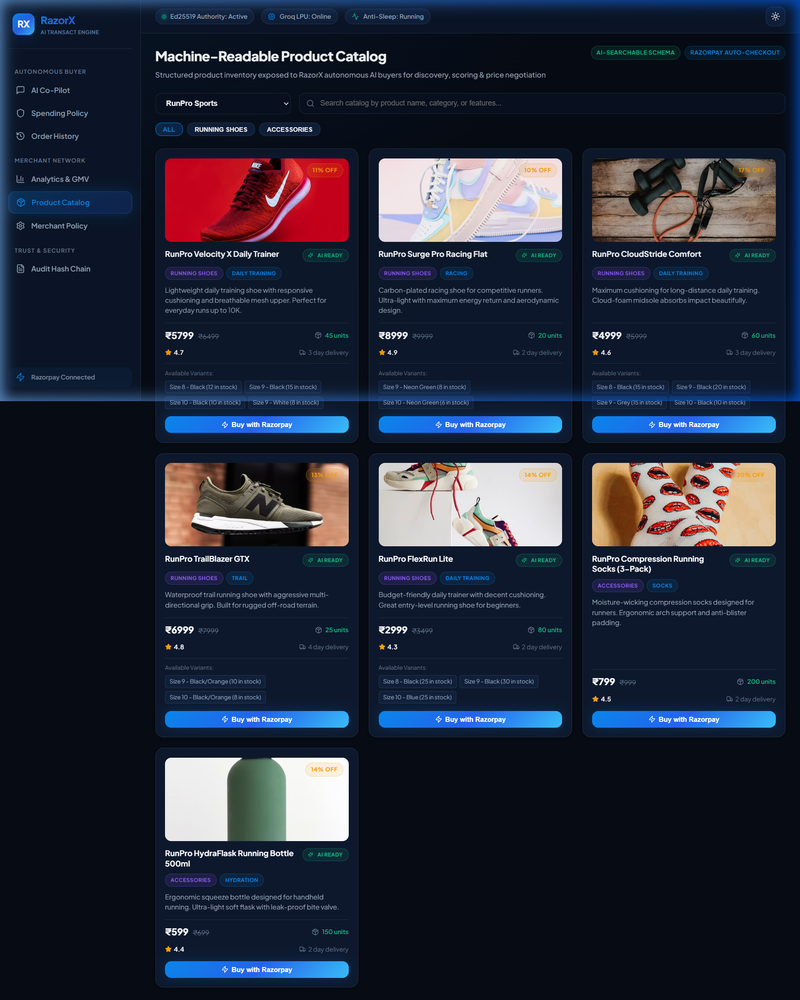
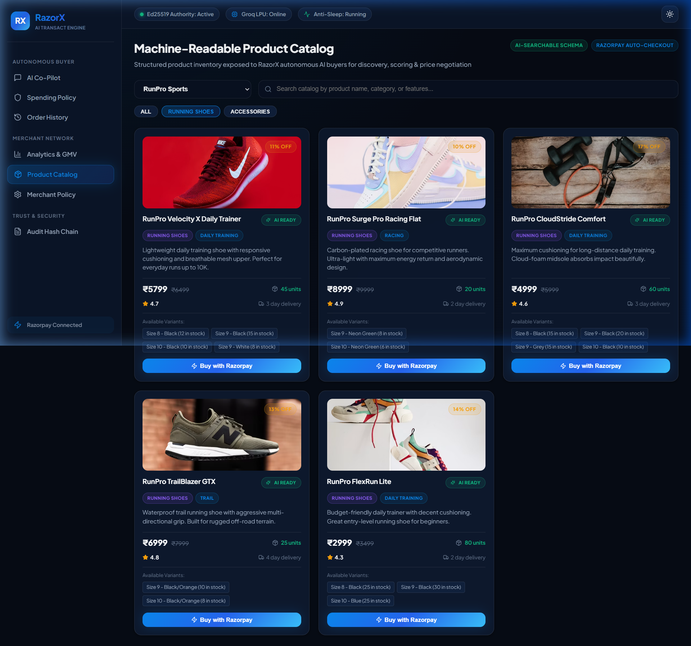
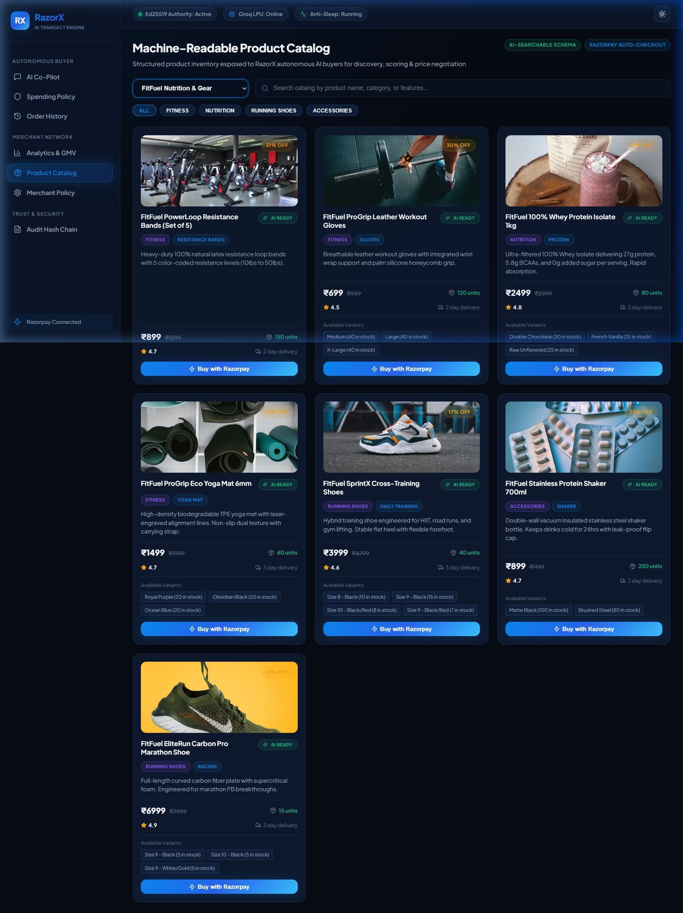
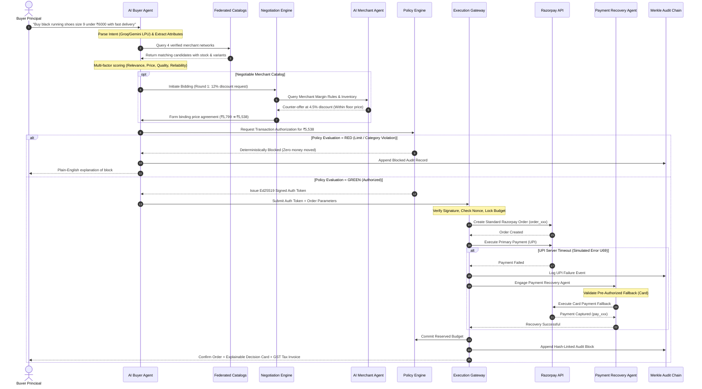

<div align="center">

# 🛡️ RazorX AI
### *Give AI the Power to Transact. Keep 100% Control of the Money.*

**The Cryptographically Bound Autonomous Commerce & Permissioned Payment Layer for AI Agents**

[](LICENSE)
[](SECURITY_ARCHITECTURE.md)
[](SECURITY_ARCHITECTURE.md)
[](https://www.typescriptlang.org/)
[](https://vitejs.dev/)
[](ARCHITECTURE.md)

<br/>


<br/><br/>

### 🎥 [▶ Watch Live Full-System Demonstration Video](https://drive.google.com/file/d/1QFWzYUpMpgovVWtj7idxNNgx2ak0DvIA/view?usp=drive_link)
*End-to-End Walkthrough: Natural Language Intent Parsing ➔ Federated Multi-Store Discovery ➔ Autonomous AI-to-AI Price Bidding ➔ Deterministic Policy Gate ➔ Ed25519 Signed Token Authorization ➔ Execution Gateway ➔ Autonomous UPI-to-Card Recovery ➔ Explainable Decision Card & Tax Invoice*

---

</div>

## 📌 Executive Overview & Core Problem

As autonomous AI agents evolve from read-only conversational assistants into active economic actors that can plan, evaluate, and purchase goods, a catastrophic architectural dilemma emerges:

> **Generative AI models cannot be trusted with raw financial credentials or unrestricted payment gateway APIs.**  
> LLMs hallucinate, misinterpret pricing boundaries, suffer from nondeterministic reasoning, and are inherently vulnerable to prompt injection attacks. Giving an AI model direct API keys or card details creates an intolerable financial liability.

**RazorX (AgentGate)** solves this fundamental bottleneck by establishing a **Zero-Trust Cryptographic Execution Gateway** between autonomous AI agents and modern payment rails.

AgentGate gives AI agents the freedom to discover, compare, and bargain across merchant catalogs, while enforcing a **Deterministic Mathematical Policy Engine** that guarantees zero out-of-bounds spending, eliminates replay attacks via **Ed25519 digital signatures (RFC 8032)**, isolates concurrent budget exhaustion via **Atomic Reservations**, and ensures total immutability through **SHA-256 Merkle Audit Chains**.

```
┌─────────────────────────┐          ┌───────────────────────────┐          ┌─────────────────────────┐
│     AI AGENT PLANE      │          │ DETERMINISTIC TRUST GATE  │          │     FINANCIAL RAILS     │
│                         │          │                           │          │                         │
│ • Natural Language      │          │ • Single Limit Check      │          │ • Razorpay Standard     │
│ • Multi-Store Discovery │ ───────► │ • Velocity Limits (D/W)   │ ───────► │ • Verified Merchants    │
│ • AI-to-AI Negotiation  │          │ • Category Whitelisting   │          │ • Standard Webhooks     │
│ • Candidate Ranking     │          │ • Ed25519 Authorization   │          │ • Automated Recovery    │
└─────────────────────────┘          └───────────────────────────┘          └─────────────────────────┘
   (Generative / Advisory)               (Strict Deterministic Gate)             (Immutable Settlement)
```

---

## 📸 Interactive UI & Platform Showcase

The platform delivers a high-performance, dark-mode glassmorphic workspace tailored for both consumer autonomous shopping and merchant operational analytics.

<div align="center">

### 1. 🤖 AI Buyer Co-Pilot & Autonomous Commerce Workspace
*Natural language intent parsing, live discovery across 4 merchant networks, real-time thought streams, interactive multi-round negotiation logs, and 1-click autonomous purchase executions.*



---

### 2. ⚡ Autonomous AI-to-AI Price Negotiation & Live Order Execution
*Automated bidding rounds between Buyer and Merchant agents, securing validated discounts before policy authorization and live order creation.*



---

### 3. 🛡️ Deterministic Spending Policy & Security Governance Gate
*Real-time velocity meters (Daily & Weekly limits), single transaction ceilings, category whitelists, cryptographic key rotation, and automated fallback controls.*



---

### 4. 📊 Merchant Command Center & Autonomous Analytics
*Real-time GMV tracking, AI negotiation margin protections, automated dispute resolution, inventory synchronization, and webhook settlement health.*



---

### 5. 🛍️ Federated Multi-Store Catalog & Direct Checkout
*26 curated products across 4 verified merchants featuring authentic high-definition photography, live stock matrices, and direct test checkouts.*



---

### 6. 🎧 Category-Specific Autonomous Execution & Multi-Store Discovery
*Granular subcategory matching for noise-cancelling audio, sports apparel, college essentials, and nutrition supplements.*

| TechNest Electronics Storefront | FitFuel Fitness & Nutrition Storefront |
| :---: | :---: |
|  |  |

</div>

---

## 🏗️ Comprehensive System Architecture

AgentGate is architected around **Zero-Trust Financial Isolation**. The autonomous agents operate in an advisory and orchestration capacity, while the deterministic policy middleware sits between the agent and payment execution.

```
                               ┌────────────────────────────────────────┐
                               │           Human Principal              │
                               │   (Configures Spending & Policy)       │
                               └──────────────────┬─────────────────────┘
                                                  │
                                                  ▼
┌────────────────────────────────────────────────────────────────────────────────────────────────────────┐
│                                       AGENTIC REASONING PLANE                                          │
│                                                                                                        │
│   ┌────────────────────────┐      Groq / Gemini LPU      ┌─────────────────────────┐                   │
│   │    AI Buyer Agent      │ ◄─────────────────────────► │    AI Merchant Agent    │                   │
│   │  (Intent & Discovery)  │                             │ (Margin Policy & Stock) │                   │
│   └───────────┬────────────┘                             └────────────┬────────────┘                   │
│               │                                                       │                        │
│               └────────────────────────► ┌──────────────────────────┐ ◄┘                               │
│                                          │  AI Negotiation Protocol │                                  │
│                                          │   (Multi-Round Bidding)  │                                  │
│                                          └────────────┬─────────────┘                                  │
└───────────────────────────────────────────────────────┼────────────────────────────────────────────────┘
                                                        │ Candidate Order + Agreed Price
                                                        ▼
┌────────────────────────────────────────────────────────────────────────────────────────────────────────┐
│                                   DETERMINISTIC TRUST GATEWAY                                          │
│                                                                                                        │
│    ┌──────────────────────────────────────────────────────────────────────────────────────────────┐    │
│    │  • Single Transaction Limit (≤ ₹6,000)             • Category Whitelist Verification         │    │
│    │  • Daily & Weekly Spending Velocity Meters        • Authorized Payment Method Check         │    │
│    │  • Nonce Anti-Replay Ledger Verification          • Ed25519 Cryptographic Token Generator   │    │
│    └──────────────────────────────────────────────┬───────────────────────────────────────────────┘    │
│                                                   │                                                    │
│                       ┌───────────────────────────┴───────────────────────────┐                        │
│                       │                                                       │                        │
│          [GREEN: Ed25519 Signed Auth]                                    [RED: Hard Block]             │
│                       │                                                       │                        │
│                       ▼                                                       ▼                        │
│       ┌───────────────────────────────┐                       ┌───────────────────────────────┐        │
│       │  Centralized Execution Gate   │                       │  Safe Zero-Spend Halt         │        │
│       │ • Asymmetric Signature Check │                       │  (Logged to Audit Chain)      │        │
│       │ • Atomic Budget Lock (Race)   │                       └───────────────────────────────┘        │
│       └───────────────┬───────────────┘                                                                │
│                       │ Bound & Verified                                                               │
│                       ▼                                                                                │
│       ┌───────────────────────────────┐                                                                │
│       │ Razorpay Execution (Standard) │                                                                │
│       └───────────────┬───────────────┘                                                                │
│                       │                                                                                │
│             ┌─────────┴─────────┐                                                                      │
│             ▼                   ▼                                                                      │
│        [CAPTURED]           [DECLINED]                                                                 │
│             │                   │                                                                      │
│             │                   ▼                                                                      │
│             │     ┌───────────────────────────┐                                                        │
│             │     │   Payment Recovery Agent  │                                                        │
│             │     │ (Authorized Card Fallback)│                                                        │
│             │     └─────────────┬─────────────┘                                                        │
│             │                   │                                                                      │
│             └───────────► ◄─────┘                                                                      │
│                           │                                                                            │
│                           ▼                                                                            │
│       ┌───────────────────────────────────────┐                                                        │
│       │ HMAC Webhook Reconciliation & Ledger  │                                                        │
│       └───────────────────┬───────────────────┘                                                        │
└───────────────────────────┼────────────────────────────────────────────────────────────────────────────┘
                            │
                            ▼
┌────────────────────────────────────────────────────────────────────────────────────────────────────────┐
│                               TAMPER-EVIDENT CRYPTOGRAPHIC AUDIT LAYER                                 │
│                                                                                                        │
│   ┌──────────────────────────────────────────────┐    ┌────────────────────────────────────────────┐   │
│   │   Explainable Decision Card & Tax Invoice    │    │      SHA-256 Merkle Audit Chain            │   │
│   │       (What, Why, Price, Alternatives)       │    │     (Cryptographically Linked Blocks)      │   │
│   └──────────────────────────────────────────────┘    └────────────────────────────────────────────┘   │
└────────────────────────────────────────────────────────────────────────────────────────────────────────┘
```

---

## ⚡ End-to-End Autonomous Transaction Lifecycle



---

## 🔒 Security, Trust & Cryptographic Integrity

### 1. Asymmetric Transaction Signatures (Ed25519 / RFC 8032)
When a transaction satisfies all deterministic policy invariants, the Policy Engine generates a cryptographically signed authorization token using an **Ed25519 private key**:
$$\text{Signature} = \text{Sign}_{\text{privKey}}\Big(\text{SHA-256}\big(\text{user\_id} \mathbin{\Vert} \text{merchant\_id} \mathbin{\Vert} \text{amount} \mathbin{\Vert} \text{nonce} \mathbin{\Vert} \text{category} \mathbin{\Vert} \text{policy\_hash}\big)\Big)$$
- If any parameter is tampered with (e.g., amount altered from ₹5,538 to ₹5,539, or merchant ID modified), signature verification **fails closed**, aborting the transaction before hitting payment gateways.

### 2. Idempotency & Nonce Anti-Replay Defense
- Every transaction authorization contains a unique UUIDv4 nonce.
- The Execution Gateway checks the nonce against an in-memory/PostgreSQL ledger.
- Nonces are consumed atomically upon gateway ingestion, preventing double-spend and replay attacks.

### 3. Atomic Mutex Budget Reservation Engine
- To prevent concurrent race conditions where parallel requests bypass daily velocity limits, AgentGate uses an **Atomic Budget Reservation Engine**.
- Funds are locked into a pending reservation state *before* invoking Razorpay APIs and committed only upon payment confirmation.

### 4. SHA-256 Merkle Audit Hash Chain
Every decision, transaction, policy evaluation, and failure recovery is permanently appended to a tamper-evident audit ledger:
$$\text{Block\_Hash}_n = \text{SHA-256}\big(\text{Block\_Hash}_{n-1} \mathbin{\Vert} \text{Timestamp} \mathbin{\Vert} \text{SessionID} \mathbin{\Vert} \text{Action} \mathbin{\Vert} \text{Payload}\big)$$
- If an attacker alters, deletes, or reorders any historical record, the cryptographic hash chain breaks, immediately alerting the system.

---

## 🤖 Multi-Agent Orchestration Plane

AgentGate organizes commerce interactions across four specialized agents:

### 1. AI Buyer Agent
- **Semantic Intent Classifier**: Extracts structured search criteria, max budget, size, color, brand preferences, and use-cases from natural language.
- **Federated Multi-Merchant Querying**: Discovers relevant items across distributed merchant catalogs.
- **Multi-Factor Scoring Function**:
  $$\text{Score} = w_{\text{rel}} \cdot S_{\text{rel}} + w_{\text{sub}} \cdot S_{\text{sub}} + w_{\text{price}} \cdot S_{\text{price}} + w_{\text{qual}} \cdot S_{\text{qual}} + w_{\text{relb}} \cdot S_{\text{merchant}}$$

### 2. AI Merchant Agent
- **Machine-Readable Catalog Publisher**: Exposes variant-level inventory, technical specifications, and AI purchase eligibility.
- **Autonomous Margin Protector**: Holds strict discount boundaries ($D_{\text{max}}$) and inventory-based counter-offer algorithms.
- **Contextual Affinity Engine**: Suggests relevant complementary accessories post-purchase without exceeding user budget caps.

### 3. AI-to-AI Bounded Negotiation Engine
- **Round 1 (Opening Offer)**: Buyer Agent calculates opening bid ($P_0 = P_{\text{orig}} \times 0.88$).
- **Round 2 (Counter-Offer)**: Merchant Agent evaluates against its floor price:
  $$P_{\text{floor}} = P_{\text{original}} \times (1 - D_{\text{max\_merchant}})$$
- **Round 3 (Agreement Settlement)**: Concessions converge to an optimal discount that respects buyer budget and protects merchant gross margin.

### 4. Autonomous Payment Recovery Agent
- Manages transient transaction failures via a deterministic state machine.
- Monitors error classifications (e.g., `UPI server timeout / Error U69`).
- Automatically transitions through the user's pre-authorized fallback payment methods (`UPI` $\rightarrow$ `Card` $\rightarrow$ `Netbanking` $\rightarrow$ `Payment Link`).
- Safely halts if maximum recovery attempts ($N_{\text{max}} = 3$) or policy velocity limits are reached.

---

## 🏬 Federated Verified Merchant Network

The platform integrates **4 realistic verified merchant stores** publishing structured catalogs with live inventory matrices:

```
├── 🏃 RunPro Sports (Athletic Footwear & Performance Apparel)
│   ├── Velocity X Daily Trainer — ₹5,799 (Road running / Cushioned)
│   ├── Surge Pro Carbon Racer — ₹5,999 (Marathon / Carbon fiber plate)
│   ├── CloudStride Cushion Running Shoe — ₹4,899 (Comfort daily trainer)
│   ├── TrailBlazer All-Terrain Runner — ₹5,299 (Vibram grip trail shoe)
│   ├── FlexRun Lite Lightweight Sneaker — ₹2,999 (Budget breathable runner)
│   ├── RunPro Anti-Blister Running Socks (3-Pack) — ₹799
│   └── RunPro HydraFlask 750ml Insulated Bottle — ₹599
│
├── ⚡ TechNest Electronics (Next-Gen Consumer Technology & Audio)
│   ├── AirBuds Pro ANC Wireless Earbuds — ₹4,499 (Active noise cancellation)
│   ├── SmartBand Pulse Health Tracker — ₹2,499 (SpO2 / Heart rate / 14-day battery)
│   ├── VoltBank 20,000mAh 65W Fast Power Bank — ₹2,999 (Dual USB-C / Laptop charging)
│   ├── MiniSpeaker Blast Bluetooth Audio — ₹1,899 (IPX7 waterproof / 360 sound)
│   ├── UltraCharge 45W GaN Dual Port Charger — ₹1,299 (Compact GaN III fast charger)
│   └── ProWatch Ultra Smartwatch — ₹5,499 (AMOLED display / GPS / Bluetooth call)
│
├── 🎓 CampusMart Essentials (Student Ergonomics & Study Hardware)
│   ├── StudyBeam LED Smart Desk Lamp — ₹1,499 (Touch dimming / USB charging port)
│   ├── ErgoLift Aluminum Laptop Stand — ₹1,899 (Foldable / Heat dissipation)
│   ├── Urban Scholar Waterproof Backpack — ₹2,199 (15.6" laptop sleeve / Rainproof)
│   ├── CampusMart BudgetBuds TWS — ₹999 (True wireless / 24h playtime)
│   ├── QuickRun Everyday Shoes — ₹1,899 (Campus daily walking sneakers)
│   └── NoteBook Pro A4 Ruled Hardbound (5-Pack) — ₹499
│
└── 🥗 FitFuel Nutrition & Gear (Fitness Equipment & Sports Supplements)
    ├── PowerLoop Resistance Bands Set (5-Pack) — ₹899 (Latex loop bands with bag)
    ├── GripTech Leather Workout Gloves — ₹699 (Wrist wrap support / Anti-slip)
    ├── 100% Whey Protein Isolate 1kg — ₹3,299 (27g protein per scoop / Chocolate)
    ├── EcoGrip Natural Rubber Yoga Mat — ₹1,499 (6mm dual-side non-slip mat)
    ├── SprintX Cross-Training Gym Shoes — ₹4,299 (Flat stable lifting base)
    ├── FitFuel Stainless Steel Shaker Bottle 700ml — ₹899
    └── Marathon Pro Distance Runner — ₹5,499 (High energy return foam)
```

---

## 📋 Explainable Decision Cards & Tax Invoices

Every completed transaction generates an **Explainable Decision Card** and a **GST-Compliant Tax Invoice**:

```
┌─────────────────────────────────────────────────────────────────────────────┐
│                        EXPLAINABLE DECISION CARD                            │
├─────────────────────────────────────────────────────────────────────────────┤
│  📦 What I bought:        RunPro Velocity X Daily Trainer (Size 9, Black)   │
│  🏪 Merchant:             RunPro Sports (Rating: 4.6/5, Reliability: 94%)   │
│  💰 How much I paid:      ₹5,538 (List: ₹5,799 — Saved ₹261 / 4.5% via AI)  │
│  🎯 Why I chose it:       100% size/color match, responsive cushioning,     │
│                           top ranked candidate (94/100 match score).        │
│  🔍 Alternatives scanned: 5 candidates evaluated across 4 network merchants │
│  🔐 Policy evaluation:    GREEN — Within single limit (₹6,000),             │
│                           daily budget (₹4,462 remaining), category allowed │
│  💳 Payment route:        UPI Declined (U69 Timeout) ➔ Autonomously         │
│                           recovered via Card (pay_demo_9a8f2bc)             │
│  📋 Order Reference:      ord_ba5525b8-82d9-4545-ae3f-6b4142a04620          │
└─────────────────────────────────────────────────────────────────────────────┘
```

---

## ⚙️ Core Technical Stack

| Layer | Technologies |
| :--- | :--- |
| **Backend & Execution API** | Node.js (v20+), Express, TypeScript 5.7, Razorpay Official SDK, Ed25519 Native Crypto, Supabase PostgreSQL Client |
| **Frontend & Co-Pilot UI** | React 18, Vite 6, TailwindCSS / Custom Glassmorphism Theme System, Lucide React, HTML5 Canvas |
| **Agentic Reasoning Plane** | Groq LPU API / Gemini 2.0 Flash, Semantic Regex Rule-Based Fallback Engine |
| **Cryptographic Layer** | Node.js `crypto` (Ed25519 RFC 8032, SHA-256 Hash Chaining, HMAC-SHA256) |
| **Media & CDN Infrastructure** | Cloudinary CDN, Supabase Storage, Verified Unsplash High-Definition Photography |
| **Testing & Invariants** | Node.js Test Runner, TypeScript Test Harnesses (525+ Invariant Unit & Integration Tests) |

---

## 👥 Authors & License

- **Architect & Full-Stack Engineer**: Rajat Para ([GitHub](https://github.com/rajat9para))
- **License**: Released under the open-source **[MIT License](LICENSE)**.

<div align="center">
  <sub>RazorX (AgentGate) • The Cryptographically Bound Trust Layer for Autonomous AI Commerce</sub>
</div>
