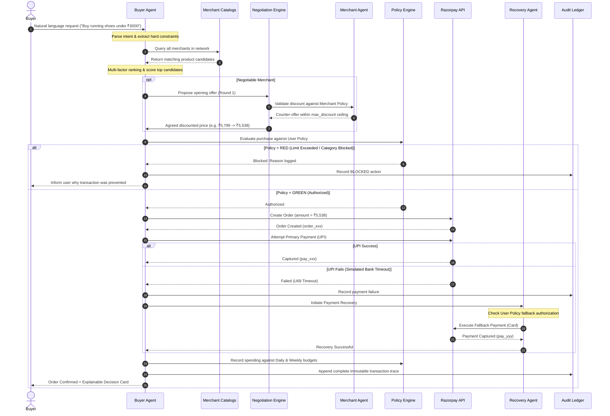

# AgentGate — Autonomous AI Commerce on Razorpay

> **Let AI Buy. Keep Control of the Money.**  
> *The permissioned transaction layer that enables AI agents to discover, negotiate, and execute purchases across AI-readable merchants without giving language models unrestricted financial access.*

---

## 1. Executive Summary & The Paradigm Shift

### From Chatbots to Autonomous Transacting Agents
Traditional e-commerce chatbots are conversational search engines: they suggest links, answer product questions, and redirect human users to manual checkouts. 

**AgentGate represents a fundamental paradigm shift into true Agentic Commerce.** In AgentGate:
1. The **Buyer delegates bounded purchasing authority** once via a structured policy.
2. The **AI Buyer Agent** parses natural language, scans a federated network of AI-readable merchant catalogs, scores candidate products across multi-dimensional criteria, and autonomously negotiates pricing.
3. The **Deterministic Policy Engine** validates every parameter against hard mathematical rules (single transaction limits, daily/weekly velocity limits, allowed categories, and authorized payment fallback chains).
4. If approved (`GREEN`), the system autonomously triggers **Razorpay Test Mode execution**.
5. If a payment declines (e.g., bank timeout on UPI), the **Payment Recovery Agent** executes an authorized fallback strategy (e.g., automated switch to Card) without human intervention.
6. Every single thought, candidate comparison, negotiation round, policy evaluation, and payment event is permanently anchored in an **Immutable, Explainable Audit Trail**.

```
┌─────────────────────────────────────────────────────────────────────────────┐
│                          THE CORE ENGINEERING RULE                          │
│                                                                             │
│         "Language Models determine intent and candidate ranking;            │
│          Deterministic code determines authority and money movement."       │
│                                                                             │
│    The LLM never directly touches API keys, payment execution endpoints,   │
│                   or unrestricted bank balances.                            │
└─────────────────────────────────────────────────────────────────────────────┘
```

---

## 2. Core Architectural Design

AgentGate is designed around **Zero-Trust Financial Isolation**. The autonomous agents operate in an advisory and orchestration capacity, while the deterministic policy middleware sits between the agent and Razorpay.

```
                      ┌─────────────────────────────────┐
                      │          Human User             │
                      │  (Defines Objective & Policy)   │
                      └────────────────┬────────────────┘
                                       │
                                       ▼
┌─────────────────────────────────────────────────────────────────────────────┐
│                            AGENTIC CO-PILOT LAYER                           │
│                                                                             │
│   ┌─────────────────────┐                  ┌────────────────────────────┐   │
│   │   AI Buyer Agent    │ ◄───Gemini AI──► │    AI Merchant Agent       │   │
│   │ (Discovery & Score) │                  │ (Catalog & Discount Policy)│   │
│   └──────────┬──────────┘                  └─────────────┬──────────────┘   │
│              │                                           │                  │
│              └───────────────► ┌───────────────────────┐ ◄┘                  │
│                                │   Negotiation Agent   │                    │
│                                │  (Bounded Bargaining) │                    │
│                                └───────────┬───────────┘                    │
└────────────────────────────────────────────┼────────────────────────────────┘
                                             │ Candidate + Negotiated Price
                                             ▼
┌─────────────────────────────────────────────────────────────────────────────┐
│                     DETERMINISTIC TRUST GATEWAY (POLICY)                    │
│                                                                             │
│   ┌─────────────────────────────────────────────────────────────────────┐   │
│   │  • Single Limit Check (≤ ₹6,000)      • Category Whitelist Check    │   │
│   │  • Daily Velocity (Spent + Amount)    • Payment Method Authorization│   │
│   │  • Weekly Velocity Check              • Merchant Refund Boundary    │   │
│   └──────────────────────────────────┬──────────────────────────────────┘   │
│                                      │                                      │
│                ┌─────────────────────┴─────────────────────┐                │
│                │                                           │                │
│         [GREEN: Passed]                            [RED: Blocked]           │
│                │                                           │                │
│                ▼                                           ▼                │
│   ┌───────────────────────────┐               ┌─────────────────────────┐   │
│   │   Razorpay Execution      │               │  Safe Halt & Audit Log  │   │
│   │   (Orders / Test Mode)    │               │  (Zero Money Moved)     │   │
│   └────────────┬──────────────┘               └─────────────────────────┘   │
│                │                                                            │
│        ┌───────┴────────┐                                                   │
│        ▼                ▼                                                   │
│    [SUCCESS]        [FAILURE]                                               │
│        │                │                                                   │
│        │                ▼                                                   │
│        │   ┌─────────────────────────────┐                                  │
│        │   │   Payment Recovery Agent    │                                  │
│        │   │ (Fallback Chain / Auto-Card)│                                  │
│        │   └────────────┬────────────────┘                                  │
│        │                │ (Recovered)                                       │
│        └────────► ◄─────┘                                                   │
│                   │                                                         │
│                   ▼                                                         │
│   ┌───────────────────────────┐                                             │
│   │  Webhook Reconciliation   │                                             │
│   └───────────────┬───────────┘                                             │
└───────────────────┼─────────────────────────────────────────────────────────┘
                    │
                    ▼
┌─────────────────────────────────────────────────────────────────────────────┐
│                        TRANSPARENCY & AUDIT LEDGER                          │
│                                                                             │
│   ┌───────────────────────────┐               ┌─────────────────────────┐   │
│   │ Explainable Decision Card │               │ Immutable Audit Logs    │   │
│   │ (What, Why, Price, Route) │               │ (Full State Hierarchy)  │   │
│   └───────────────────────────┘               └─────────────────────────┘   │
└─────────────────────────────────────────────────────────────────────────────┘
```

---

## 3. The Multi-Agent Ecosystem

AgentGate organizes commerce interactions across four specialized agents:

### 1. AI Buyer Agent
- **Intent Parser**: Converts conversational inputs (e.g., *"Buy black running shoes for daily training, size 9, under ₹6,000"*) into a strongly typed `StructuredIntent`.
- **Merchant Network Discovery**: Queries structured endpoints across the merchant network.
- **Multi-Factor Scoring Engine**: Evaluates products across relevance, size/color variant availability, customer reviews, delivery turnaround, and price-to-budget ratios:
  $$\text{Score} = w_{\text{rel}}\cdot S_{\text{rel}} + w_{\text{price}}\cdot S_{\text{price}} + w_{\text{qual}}\cdot S_{\text{qual}} + w_{\text{relb}}\cdot S_{\text{merchant}}$$
- **Candidate Selector**: Selects the highest-ranking valid product that satisfies all hard constraints.

### 2. AI Merchant Agent
- **Catalog Exposure**: Publishes machine-readable schemas containing variant-level stock, technical specifications, and AI purchase eligibility.
- **Autonomous Policy Adherence**: Acts on behalf of the merchant, holding strict discount boundaries ($D_{\text{max}}$) and automated approval thresholds.
- **AI Upselling Engine**: Identifies high-affinity complementary products (e.g., hydration bottles or compression socks after running shoe purchases) without exceeding the merchant's configured maximum offer cap.

### 3. Negotiation Agent (Agent-to-Agent Bargaining Protocol)
- Orchestrates multi-round automated price discovery between the Buyer Agent and Merchant Agent.
- **Round 1 (Opening)**: Buyer Agent calculates opening bid ($P_0 = P_{\text{orig}} \times 0.88$). Merchant AI responds with counter-offer within allowed discount limits.
- **Round 2 (Convergence)**: Buyer Agent proposes mid-point concession. Merchant AI evaluates floor price $P_{\text{floor}} = P_{\text{orig}} \times (1 - D_{\text{max}})$.
- **Round 3 (Settlement)**: If the final price is within the buyer's maximum budget and satisfies the merchant's floor price, a binding agreement is formed.

### 4. Payment Recovery Agent
- Manages transaction failures through a deterministic fallback state machine.
- Monitors error descriptions (e.g., `UPI transaction declined: Bank server timeout. Error code: U69`).
- Steps through the buyer's authorized fallback chain (`UPI` $\rightarrow$ `Card` $\rightarrow$ `Netbanking` $\rightarrow$ `Payment Link`).
- Halts execution safely when maximum recovery attempts ($N_{\text{max}} = 3$) or policy limits are reached.

---

## 4. End-to-End Transaction Control Flow



---

## 5. Deterministic Policy Engine (The Trust Boundary)

The Policy Engine serves as the non-negotiable security firewall. No generative AI model has the capability to override or bypass this layer.

### Policy Evaluation Matrix

| Decision | Condition | System Action |
| :--- | :--- | :--- |
| **`GREEN`** | $P_{\text{order}} \le L_{\text{single}}$ **AND** $\sum P_{\text{daily}} + P_{\text{order}} \le L_{\text{daily}}$ **AND** $\text{Category} \in C_{\text{allowed}}$ **AND** $\text{Method} \in M_{\text{allowed}}$ | **Execute Autonomous Payment** |
| **`AMBER`** | Primary payment method declined, but authorized fallback method exists in policy | **Trigger Autonomous Recovery** |
| **`RED`** | Transaction exceeds single limit, daily/weekly budget, or unapproved category | **Hard Block & Audit Logging** |

### Mathematical Invariants Enforced
1. **Single Transaction Invariant**:
   $$P_{\text{final}} \le L_{\text{single\_transaction}}$$
2. **Daily Spending Velocity Invariant**:
   $$\sum_{i=1}^{k} P_i + P_{\text{final}} \le L_{\text{daily}}$$
3. **Weekly Cumulative Invariant**:
   $$\sum_{j=1}^{m} P_j + P_{\text{final}} \le L_{\text{weekly}}$$
4. **Merchant Floor Price Invariant**:
   $$P_{\text{negotiated}} \ge P_{\text{original}} \times (1 - D_{\text{max\_merchant}})$$

---

## 6. Explainable Decision Framework (PRD Section 6.15)

To ensure zero cognitive ambiguity for the user, every completed transaction generates an **Explainable Decision Card**:

```
┌─────────────────────────────────────────────────────────────────────────────┐
│                        EXPLAINABLE DECISION CARD                            │
├─────────────────────────────────────────────────────────────────────────────┤
│  📦 What I bought:        RunPro Velocity X Daily Trainer (Size 9, Black)   │
│  🏪 Merchant:             RunPro Sports (Rating: 4.6/5, Reliability: 94%)   │
│  💰 How much I paid:      ₹5,538 (List: ₹5,799 — Saved ₹261 / 4.5% via AI)  │
│  🎯 Why I chose it:       100% size/color match, responsive cushioning,     │
│                           top ranked candidate (94/100 match score).        │
│  🔍 Alternatives scanned: 5 candidates evaluated across 4 network merchants │
│  🔐 Policy evaluation:    GREEN — Within single limit (₹6,000),             │
│                           daily budget (₹4,462 remaining), category allowed │
│  💳 Payment route:        UPI Declined (U69 Timeout) ➔ Autonomously         │
│                           recovered via Card (pay_demo_9a8f2bc)             │
│  📋 Order Reference:      ord_ba5525b8-82d9-4545-ae3f-6b4142a04620          │
└─────────────────────────────────────────────────────────────────────────────┘
```

---

## 7. Opportunity Override Engine

Autonomous agents must not inflate budgets under the guise of finding "better" products. AgentGate solves this via the **Opportunity Override Engine**:

1. The agent **first guarantees and completes the purchase** within the user's explicit budget constraints.
2. It simultaneously scans for superior products within a strictly bounded overshoot window:
   $$\text{Price}_{\text{candidate}} \le \text{Budget} \times (1 + \text{MaxOvershoot})$$
3. An Opportunity Alert is triggered **only** if the candidate satisfies both criteria:
   - **Price within Overshoot Boundary**: $\frac{P_{\text{opp}} - L_{\text{single}}}{L_{\text{single}}} \le \text{MaxOvershoot}$ (e.g., $\le 20\%$)
   - **Material Improvement Threshold**: $\frac{\text{Score}_{\text{opp}} - \text{Score}_{\text{selected}}}{\text{Score}_{\text{selected}}} \ge \text{MinImprovement}$ (e.g., $\ge 8\%$)
4. If valid, the opportunity is presented to the user with an explicit one-click upgrade option. The agent **never** purchases above-budget items autonomously.

---

## 8. Merchant AI Growth & Monetization Engine

AgentGate transforms conventional merchants into active nodes in the AI commerce economy:

```
┌─────────────────────────────────────────────────────────────────────────────┐
│                         MERCHANT AI REVENUE STREAMS                         │
├─────────────────────────────────────────────────────────────────────────────┤
│  1. Autonomous Conversions: Captures high-intent AI buyers searching        │
│     across the federated network.                                           │
│  2. Dynamic Bounded Negotiation: Converts price-sensitive buyers while      │
│     strictly protecting gross margins.                                      │
│  3. Payment Recovery Revenue: Rescues otherwise lost sales through          │
│     delegated payment method switching.                                     │
│  4. Contextual AI Upselling: Increases Average Order Value (AOV) by         │
│     recommending complementary catalog items post-purchase.                 │
│  5. Machine-Readable Exposure: Eliminates human UI search friction with     │
│     structured attribute discovery.                                         │
└─────────────────────────────────────────────────────────────────────────────┘
```

### Real-Time Merchant Telemetry
- **AI Revenue**: Cumulative revenue originated by autonomous buyer sessions.
- **AI Conversion Rate**: Ratio of completed AI checkouts to initiated sessions.
- **Recovered Payment Revenue**: Revenue salvaged by the Payment Recovery Agent.
- **AI Upsell Revenue**: Value created through autonomous post-purchase recommendations.
- **Blocked Actions Counter**: Records unauthorized attempts rejected by the policy engine.

---

## 9. Security, Trust & Financial Integrity Model

### 1. Zero-Trust Money Gateways
Payment execution tools (`createRazorpayOrder`, `simulatePayment`, `createPaymentLink`) reside exclusively on the server side and require explicit cryptographic or policy tokens generated during deterministic evaluation.

### 2. Webhook Event Deduplication & State Machine
Payment capture is never assumed solely from client-side callbacks. The backend maintains an idempotent state machine driven by Razorpay webhooks:

```
  [Created] ──► [Payment Processing] ──► [Payment Failed]
                        │                       │
                        │ (Captured Webhook)    │ (Recovery Succeeded)
                        ▼                       ▼
                    [Paid] ◄────────────────────┘
                        │
                        ▼
                   [Delivered]
```

- Webhook signatures are verified via HMAC-SHA256.
- Unique event IDs (`evt_xxx`) are deduplicated to ensure exactly-once processing.

### 3. Immutable Audit Ledger
Every atomic agent action generates an audit entry capturing:
- `timestamp`: ISO-8601 UTC timestamp
- `session_id` & `order_id`: Traceability keys
- `agent_id`: Specific agent responsible (`buyer-agent`, `merchant-agent`, `recovery-agent`)
- `action`: Specific operation executed
- `requested_amount` vs. `approved_amount`
- `policy_result`: Deterministic decision (`GREEN`, `AMBER`, `RED`)
- `result`: Execution status (`success`, `failed`, `blocked`, `pending`)
- `reason`: Plain-language explanation for compliance and user transparency.

---

## 10. Summary

AgentGate creates a secure, robust bridge between generative AI decision-making and real-world payment execution. By enforcing strict separation between **intent generation** (handled by AI) and **financial authorization** (handled by deterministic policy), AgentGate allows consumers to delegate repetitive commerce workflows while maintaining absolute, uncompromising control over their money.
